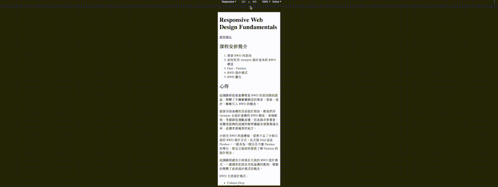
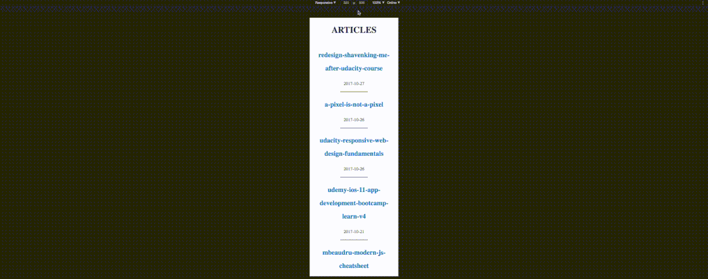

## 簡介

因為[看完 Udacity 上的課程 Responsive Web Design Fundamentals](udacity-responsive-web-design-fundamentals) 之後，決定來更進一步，練習一下剛剛學到的 RWD 知識，重新設計一下這個 [shavenking.me](http://shavenking.me)。

## 目前樣式：零設計

為什麼稱為零設計？因為完全沒有設計。

## 新樣式：壹設計

為什麼稱為壹設計？因為完全想不到命名。

先從手機介面開始（老師教的）。

### 手機介面設計要點

1. 手機版介面可以在不用手指縮放的狀況下，輕鬆瀏覽。
2. 可點選的物件要夠大，約 40px - 48px 的長寬。
3. 讓使用者優先讀到標題，然後才是日期。
4. 內文行高為 1.5 倍行高。
5. 圖片需滿版並依照不同裝置大小縮放（最大寬度 100%）。

### 桌面介面設計要點

1. 整個網站的最大寬度為 700px，再大就不適合閱讀了（參考 [Medium](https://medium.com)）。
2. 其餘同手機介面

### 實作要點

1. 用 [normalize.css](https://necolas.github.io/normalize.css/) 初始化。
2. 不使用框架。
3. 使用 Flexbox。

### [統一配色](http://coolors.co/31393c-456990-008dd5-f45b69-129490)

- 有點黑：`#31393c`
- 感覺是深藍：`#456990`
- 應該是亮藍：`#008dd5`
- 也許是紅：`#f45b69`
- 綠綠的：`#129490`

### 大概會長這樣

呃... 預覽畫面都出來了不就代表作完了嗎？

## 自問自答

### 問：實作上的困難？

沒有，因為其實只有測試 Mac Chrome 和 iOS Safari 兩種瀏覽器而已，一定有些瀏覽器在某些裝置的某個解析度下會炸掉。

### 問：如果不使用 Flexbox 有差嗎？

好像沒差哈哈哈，沒有很特別的 RWD 版面設計。

### 問：配色是怎麼決定的？

如果本身沒有顏色天分的話，請使用這個配色網站 [coolors.co](http://coolors.co)，我是先選定我要的黑色（當內文顏色），然後選定藍色（當連結顏色），最後再隨便生一些怪怪的顏色，反正也沒什麼用到哈哈哈。

### 問：為什麼內文要設計 700px 寬，1.5 倍行高？

基本上我是參考 [Medium](https://medium.com/)，點進去隨便一篇文章，文字的寬度都是 740px。

理論上每行文字的寬度不能太寬，閱讀體驗才會好，但也不能太窄，會影響整句文字的前後文。

1.5 倍行高是自己主觀測試覺得最舒服的設計。